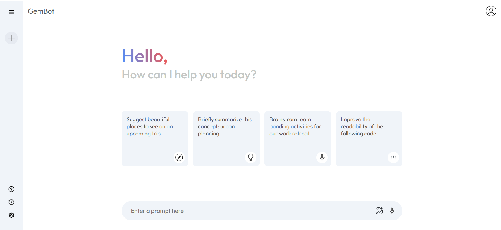
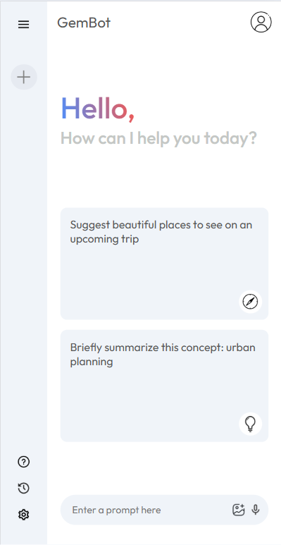

# GemBot

GemBot is a sleek and minimal AI chatbot powered by the **Gemini 1.5 Flash API** from Google. It simulates a chat-like interface that allows users to send prompts and receive intelligent responses in a conversational UI.

## ✨ Features

- 🔍 Prompt-based conversation interface
- ⌛ Animated word-by-word response rendering
- 📑 Recent prompt history with reload option
- ⚡ Fast responses using Gemini Pro model (`gemini-1.5-flash`)
- 🎨 Responsive and clean UI using React & CSS

---
## 🚀 Tech Stack

- **React** (Functional Components & Hooks)
- **Google Generative AI** (`@google/generative-ai`)
- **Vite** (for fast development)
- **CSS** (custom responsive styles)
- **Context API** (for global state management)

---

## 📸 Screenshots
### Home Screen


### Loading response


### Chat Response


### Reponsiveness
<div>

  &nbsp; &nbsp; &nbsp; &nbsp;

</div>

---

## 🧠 Project Structure

```yaml
src/
├── assets/ # Icons and images used in UI
├── components/
│ ├──  Main/
│ │ ├── Main.jsx # Main chat UI
│ │ └── Main.css
│ └──  Sidebar/
│   ├── Sidebar.jsx # Sidebar with recent prompts
│   └── Sidebar.css
├── context/
│ └── Context.jsx # Global context provider for chat state
├── config/
│ └── gemini.js # Google Generative AI setup and response handler
├── App.jsx
├── main.jsx
└── index.css
.env
```
## 🛠️ Setup & Installation

### Prerequisites

- Node.js v16+
- A valid **Google Generative AI API Key**

### Steps

1. Clone the repository

```bash
git clone https://github.com/your-username/gembot.git
cd gembot
```
2. Install dependencies

```bash
npm install
```
3. Create environment file
Create a .env file in the root with the following line:

```ini
VITE_GEMINI_API_KEY=your_gemini_api_key_here
```
4. Run the app
```bash
npm run dev
```
The app will be live at http://localhost:5173

---
